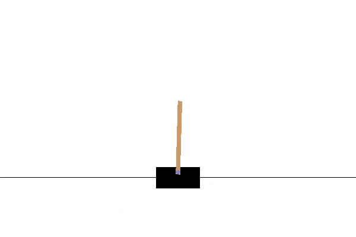

# Overview of Experiments on the [Quanser-Robot](https://git.ias.informatik.tu-darmstadt.de/quanser/clients) environments

---
This Readme contains systematic experiments for both algorithms and all three platforms. 
It allows to show the effect of hyperparameters and other choice

# Asynchronous Advantage Actor-Critic (A3C) / Advantage Actor-Critic (A2C)

We changed the default environment episode length from 10,000 to 5,000 in order to avoid computational overhead.
For stabilization there was no advantage of training with longer episode length in the final policy.
With the Swing-up we fine-tuned our final policy with 5,000 episode length using 10,000 length in order to stay within the 
environment boundaries.

## CartpoleStabShort-v0

19999.95442 +/- 0.03550 total reward with episode length of 10000.0 +/- 0.0 for 100 consecutive test runs ([Monitor files](../resources/a3c/media/stabilization/openaigym.episode_batch.0.15325.stats.json))

| done | contributor | comment                                     | solved env | type |lr-actor|lr-critic|shared-model|value-loss-weight|discount| tau | entropy-loss-weight | max-grad-norm | seed | worker | rollout steps|max-episode-length|shared-optimizer|optimizer|lr-scheduler|max-action|normalizer|n-envs| test reward (10 episodes) | steps                | training time             |
| ---- | ----------- | ------------------------------------------- | ---------- | ---  |------- | ------- | -----------| ----------------|------- | --- | --------------------| ------------- | -----| ------ | ------------ | ---------------- | -------------- | ------- | ---------- | -------- | -------- | ---- | ------------------------- | -------------------- | ------------------------- |
| [x]  | BD          | baseline                                    | [x]        | A2C  | 1e-4   | 1e-3    | FALSE      | 0.5             | 0.99   |0.99 | 0.0001              | 1.0           | 1    |  1     | 50           | 5000             | TRUE           | adam    | None       | +/-5     | None     | 5    | 9999.27 - 9999.97         | 788,195 - 19,492,710 | 00h 05m 34s - 02h 23m 00s |
| [x]  | QG          | baseline, seed=2                            | [x]        | A2C  | 1e-4   | 1e-3    | FALSE      | 0.5             | 0.99   |0.99 | 0.0001              | 1.0           | 2    |  1     | 50           | 5000             | TRUE           | adam    | None       | +/-5     | None     | 5    |           9999.13         |            2,125,250 |           00h 22m 55s     |
| [x]  | QG          | baseline, seed=3                            | [x]        | A2C  | 1e-4   | 1e-3    | FALSE      | 0.5             | 0.99   |0.99 | 0.0001              | 1.0           | 3    |  1     | 50           | 5000             | TRUE           | adam    | None       | +/-5     | None     | 5    |           9999.07         |            1,568,190 |           00h 16m 58s     |
| [x]  | QG          | baseline, seed=4                            | [x]        | A2C  | 1e-4   | 1e-3    | FALSE      | 0.5             | 0.99   |0.99 | 0.0001              | 1.0           | 4    |  1     | 50           | 5000             | TRUE           | adam    | None       | +/-5     | None     | 5    |           9999.77         |            1,627,500 |           00h 18m 28s     |
| [x]  | QG          | baseline, seed=5                            | [x]        | A2C  | 1e-4   | 1e-3    | FALSE      | 0.5             | 0.99   |0.99 | 0.0001              | 1.0           | 5    |  1     | 50           | 5000             | TRUE           | adam    | None       | +/-5     | None     | 5    |           9999.38         |            1,908,100 |           00h 21m 52s     |
| [x]  | QG          | baseline, tau=1.0                           | [x]        | A2C  | 1e-4   | 1e-3    | FALSE      | 0.5             | 0.99   | 1.0 | 0.0001              | 1.0           | 1    |  1     | 50           | 5000             | TRUE           | adam    | None       | +/-5     | None     | 5    |           9999.33         |            1,941,500 |           00h 13m 22s     |
| [x]  | BD          | baseline, tau=0.95                          | [x]        | A2C  | 1e-4   | 1e-3    | FALSE      | 0.5             | 0.99   |0.95 | 0.0001              | 1.0           | 1    |  1     | 50           | 5000             | TRUE           | adam    | None       | +/-5     | None     | 5    |           9999.39         |            1,726,550 |           00h 31m 33s     |
| [x]  | BD          | baseline, tau=0.90                          | [x]        | A2C  | 1e-4   | 1e-3    | FALSE      | 0.5             | 0.99   |0.90 | 0.0001              | 1.0           | 1    |  1     | 50           | 5000             | TRUE           | adam    | None       | +/-5     | None     | 5    |           9999.85         |            2,275,295 |           00h 39m 51s     |
| [x]  | BD          | baseline, type=A3C                          | [x]        | A3C  | 1e-4   | 1e-3    | FALSE      | 0.5             | 0.99   |0.99 | 0.0001              | 1.0           | 1    |  1     | 50           | 5000             | TRUE           | adam    | None       | +/-5     | None     | 5    |           9996.78         |            9,611,694 |           08h 09m 04s     |
| [x]  | BD          | baseline, shared-model=True                 | [x]        | A2C  | 1e-4   | 1e-3    | TRUE       | 0.5             | 0.99   |0.99 | 0.0001              | 1.0           | 1    |  1     | 50           | 5000             | TRUE           | adam    | None       | +/-5     | None     | 5    |           9996.70         |            6,637,935 |           01h 25m 00s     |
| [x]  | BD          | baseline, lr-actor=0.001                    | [x]        | A2C  | 1e-3   | 1e-3    | FALSE      | 0.5             | 0.99   |0.99 | 0.0001              | 1.0           | 1    |  1     | 50           | 5000             | TRUE           | adam    | None       | +/-5     | None     | 5    |           9999.86         |            5,239,500 |           01h 34m 04s     |
| [x]  | BD          | baseline, lr-critic=0.01                    | [x]        | A2C  | 1e-4   | 1e-2    | FALSE      | 0.5             | 0.99   |0.99 | 0.0001              | 1.0           | 1    |  1     | 50           | 5000             | TRUE           | adam    | None       | +/-5     | None     | 5    |           9999.20         |              781,630 |           00h 14m 13s     |
| [x]  | BD          | baseline, lr-critic=0.01, lr-actor=0.001    | [x]        | A2C  | 1e-3   | 1e-2    | FALSE      | 0.5             | 0.99   |0.99 | 0.0001              | 1.0           | 1    |  1     | 50           | 5000             | TRUE           | adam    | None       | +/-5     | None     | 5    |           9999.34         |              629,435 |           00h 11m 41s     |
| [x]  | QG          | baseline, n-envs=10                         | [x]        | A2C  | 1e-4   | 1e-3    | FALSE      | 0.5             | 0.99   |0.99 | 0.0001              | 1.0           | 1    |  1     | 50           | 5000             | TRUE           | adam    | None       | +/-5     | None     | 10   | 9999.76                   |            7,421,480 |           00h 31m 53s     |
| [x]  | BD          | baseline, optimize=rmsprop                  | [-]        | A2C  | 1e-4   | 1e-3    | FALSE      | 0.5             | 0.99   |0.99 | 0.0001              | 1.0           | 1    |  1     | 50           | 5000             | TRUE           | rmsprop | None       | +/-5     | None     | 5    |           9918.21         |           33,756,000 |           09h 53m 11s     |
| [x]  | BD          | baseline, rollout=100                       | [x]        | A2C  | 1e-4   | 1e-3    | FALSE      | 0.5             | 0.99   |0.99 | 0.0001              | 1.0           | 1    |  1     | 100          | 5000             | TRUE           | adam    | None       | +/-5     | None     | 5    |           9999.30         |            1,198,560 |           00h 21m 38s     |
| [x]  | BD          | baseline, rollout=20                        | [x]        | A2C  | 1e-4   | 1e-3    | FALSE      | 0.5             | 0.99   |0.99 | 0.0001              | 1.0           | 1    |  1     | 20           | 5000             | TRUE           | adam    | None       | +/-5     | None     | 5    |           9999.90         |            1,209,310 |           00h 23m 27s     |
| [x]  | BD          | baseline, discount=0.999                    | [x]        | A2C  | 1e-4   | 1e-3    | FALSE      | 0.5             | 0.999  |0.99 | 0.0001              | 1.0           | 1    |  1     | 50           | 5000             | TRUE           | adam    | None       | +/-5     | None     | 5    |           9999.24         |              917,750 |           00h 16m 32s     |
| [x]  | BD          | baseline, discount=0.95                     | [x]        | A2C  | 1e-4   | 1e-3    | FALSE      | 0.5             | 0.95   |0.99 | 0.0001              | 1.0           | 1    |  1     | 50           | 5000             | TRUE           | adam    | None       | +/-5     | None     | 5    |           9997.72         |            2,802,250 |           00h 50m 18s     |
| [X]  | BD          | baseline, discount=0.90                     | [x]        | A2C  | 1e-4   | 1e-3    | FALSE      | 0.5             | 0.90   |0.99 | 0.0001              | 1.0           | 1    |  1     | 50           | 5000             | TRUE           | adam    | None       | +/-5     | None     | 5    |           9999.23         |            3,519,005 |           01h 02m 34s     |
| [ ]  | QG,L        | baseline, lr-scheduler=Step                 | [ ]        | A2C  | 1e-4   | 1e-3    | FALSE      | 0.5             | 0.99   |0.99 | 0.0001              | 1.0           | 1    |  1     | 50           | 5000             | TRUE           | adam    | None       | +/-5     | None     | 5    | XXXXXXX - XXXXXXX         | XXXXXXX - XXXXXXXXXX | XXXXXXX - XXXXXXXXXX      |
| [x]  | QG,L        | baseline, normalizer=MeanStd                | [-]        | A2C  | 1e-4   | 1e-3    | FALSE      | 0.5             | 0.99   |0.99 | 0.0001              | 1.0           | 1    |  1     | 50           | 5000             | TRUE           | adam    | None       | +/-5     | None     | 5    |           8718.84         |           41,237,800 |          04h 31m 44s      |

[x] solved in simulation  
[x] solved in Q-Lab (real world)  

 _Our learnt policy was able to stabilize the pole on the first trial.
 We set our maximum action to +/- 10. This resulted in a rather rough policy where the cartpole robot needed to correct
 its position in order to keep the pole balanced._

## CartpoleSwingShort-v0

19521.84018  +/- 3.81556 total reward with episode length of 10000.0 +/- 0.0 for 100 consecutive test runs ([Monitor files](../resources/a3c/media/swing_up/openaigym.episode_batch.0.6170.stats.json))

| done | contributor | comment                                                           | solved env | type |lr-actor|lr-critic|shared-model|value-loss-weight|discount| tau | entropy-loss-weight | max-grad-norm | seed | worker | rollout steps|max-episode-length|shared-optimizer|optimizer|lr-scheduler|max-action|normalizer|n-envs| test reward (10 episodes) | steps                    | training time              |
| ---- | ----------- | ----------------------------------------------------------------- | ---------- | ---  |------- | ------- | -----------| ----------------|------- | --- | --------------------| ------------- | -----| ------ | ------------ | ---------------- | -------------- | ------- | ---------- | -------- | -------- | ---- | ------------------------- | ------------------------ | ----------------------     |
| [x]  | QG          | baseline                                                          | [x]        | A2C  | 0.0001 | 0.001   | FALSE      | 0.5             | 0.99   | 0.99| 0.0001              | 1.0           | 1    |  1     | 50           | 5000             | TRUE           | adam    | None       | +/-10    | None     | 5    | 9523                      | 15,060,000               | 01h 45m 04s                |
| [x]  | QG          | baseline, seed=2                                                  | [x]        | A2C  | 0.0001 | 0.001   | FALSE      | 0.5             | 0.99   | 0.99| 0.0001              | 1.0           | 2    |  1     | 50           | 5000             | TRUE           | adam    | None       | +/-10    | None     | 5    | 9532.07                   | 18,607,240               | 04h 48m 34s                |
| [x]  | QG          | baseline, seed=3                                                  | [x]        | A2C  | 0.0001 | 0.001   | FALSE      | 0.5             | 0.99   | 0.99| 0.0001              | 1.0           | 3    |  1     | 50           | 5000             | TRUE           | adam    | None       | +/-10    | None     | 5    | 9519.15                   | 27,705,750               | 06h 43m 03s                |
| [x]  | QG          | baseline, seed=4                                                  | [x]        | A2C  | 0.0001 | 0.001   | FALSE      | 0.5             | 0.99   | 0.99| 0.0001              | 1.0           | 3    |  1     | 50           | 5000             | TRUE           | adam    | None       | +/-10    | None     | 5    | 9526.39                   | 11,584,670               | 02h 25m 39s                |
| [x]  | QG          | baseline, seed=5                                                  | [x]        | A2C  | 0.0001 | 0.001   | FALSE      | 0.5             | 0.99   | 0.99| 0.0001              | 1.0           | 3    |  1     | 50           | 5000             | TRUE           | adam    | None       | +/-10    | None     | 5    | 9522.64                   | 8,164,985                | 01h 43m 46s                |
| [x]  | QG          | baseline, frq=100                                                 | [x]        | A2C  | 0.0001 | 0.001   | FALSE      | 0.5             | 0.99   | 0.99| 0.0001              | 1.0           | 1    |  1     | 50           | 5000             | TRUE           | adam    | None       | +/-10    | None     | 5    | 9897.19                   | 4,713,230                | 00h 44m 34s                |
| [x]  | QG          | baseline, frq=100, squared-reward, action_space=+/-5              | [-]        | A2C  | 0.0001 | 0.001   | FALSE      | 0.5             | 0.99   | 0.99| 0.0001              | 1.0           | 1    |  1     | 50           | 5000             | TRUE           | adam    | None       | +/-5     | None     | 5    | 9897.19                   | 10,469,560               | 01h 37m 42s (run for >5h)  |
| [x]  | QG          | baseline, frq=100, edge-fear, action_space=+/-5                   | [-]        | A2C  | 0.0001 | 0.001   | FALSE      | 0.5             | 0.99   | 0.99| 0.0001              | 1.0           | 1    |  1     | 50           | 5000             | TRUE           | adam    | None       | +/-5     | None     | 5    | 4077.34                   | 2,508,105                | 00h 40m 46s (run for >5h)  |
| [x]  | QG          | baseline, frq=50, action_space= +/-5                              | [-]        | A2C  | 0.0001 | 0.001   | FALSE      | 0.5             | 0.99   | 0.99| 0.0001              | 1.0           | 1    |  1     | 50           | 5000             | TRUE           | adam    | None       | +/-5     | None     | 5    | 6344.70                   | 4,302,470                | 00h 52m 34s (run for >9h)  |
| [x]  | QG,L        | baseline, frq=50, action_space= +/-5, rollout=100, discount=0.999 | [-]        | A2C  | 0.0001 | 0.001   | FALSE      | 0.5             | 0.99   | 0.99| 0.0001              | 1.0           | 1    |  1     | 50           | 5000             | TRUE           | adam    | None       | +/-5     | None     | 5    | 5303.52                   | 2,048,195                | 00h 33m 58s (run for >3h)  |
| [x]  | QG          | baseline, action_space=+/-5                                       | [-]        | A2C  | 0.0001 | 0.001   | FALSE      | 0.5             | 0.99   | 0.99| 0.0001              | 1.0           | 1    |  1     | 50           | 5000             | TRUE           | adam    | None       | +/-5     | None     | 5    | 5215.86                   | 54,795,000               | 06h 00m 57s (run for >8h)  |
| [x]  | BD          | baseline, action_space=+/-6                                       | [-]        | A2C  | 0.0001 | 0.001   | FALSE      | 0.5             | 0.99   | 0.99| 0.0001              | 1.0           | 1    |  1     | 50           | 5000             | TRUE           | adam    | None       | +/-6     | None     | 5    | 2492.00                   | 15,060,000               | 00h 35m 03s (run for >13h) |
| [x]  | BD          | baseline, action_space=+/-5, rollout=100                          | [-]        | A2C  | 0.0001 | 0.001   | FALSE      | 0.5             | 0.99   | 0.99| 0.0001              | 1.0           | 1    |  1     | 50           | 5000             | TRUE           | adam    | None       | +/-10    | None     | 5    | 3613.00                   | 1,937,950                | 18h 51m 29s (run for >5h)  |
| [x]  | BD          | baseline, tau=1.0                                                 | [x]        | A2C  | 0.0001 | 0.001   | FALSE      | 0.5             | 0.99   | 1.0 | 0.0001              | 1.0           | 1    |  1     | 50           | 5000             | TRUE           | adam    | None       | +/-10    | None     | 5    | 9518.00                   | 13,630,085               | 08h 08m 47s                |
| [x]  | QG          | baseline, tau=0.95                                                | [x]        | A2C  | 0.0001 | 0.001   | FALSE      | 0.5             | 0.99   | 0.95| 0.0001              | 1.0           | 1    |  1     | 50           | 5000             | TRUE           | adam    | None       | +/-10    | None     | 5    | 9537.17                   | 7,563,810                | 00h 53m 52s                |
| [x]  | QG          | baseline, tau=0.90                                                | [x]        | A2C  | 0.0001 | 0.001   | FALSE      | 0.5             | 0.99   | 0.9 | 0.0001              | 1.0           | 1    |  1     | 50           | 5000             | TRUE           | adam    | None       | +/-10    | None     | 5    | 9523.17                   | 7,108,850                | 00h 49m 02s                |
| [x]  | QG          | baseline, tau=1.0, max-action=+/-5                                | [-]        | A2C  | 0.0001 | 0.001   | FALSE      | 0.5             | 0.99   | 0.99| 0.0001              | 1.0           | 1    |  1     | 50           | 5000             | TRUE           | adam    | None       | +/-5     | None     | 5    | 4992.49                   | 9,245,565                | 01h 05m 17s                |
| [x]  | QG          | baseline, type=A3C, max-action=+/-5, worker=5                     | [-]        | A3C  | 0.0001 | 0.001   | FALSE      | 0.5             | 0.99   | 0.99| 0.0001              | 1.0           | 5    |  1     | 50           | 5000             | TRUE           | adam    | None       | +/-5     | None     | 5    | 3724.06                   | 410,686                  | 00h 24m 06s (run for >6h)  |
| [x]  | QG          | baseline, type=A3C, worker=5                                      | [-]        | A3C  | 0.0001 | 0.001   | FALSE      | 0.5             | 0.99   | 0.99| 0.0001              | 1.0           | 5    |  1     | 50           | 5000             | TRUE           | adam    | None       | +/-10    | None     | 5    | 4746.80                   | 2,148,250                | 02h 26m 24s (run for >5h)  |
| [x]  | BD          | baseline, rollout=20                                              | [-]        | A2C  | 0.0001 | 0.001   | FALSE      | 0.5             | 0.99   | 0.99| 0.0001              | 1.0           | 1    |  1     | 50           | 5000             | TRUE           | adam    | None       | +/-10    | None     | 5    | 64.38                     | 40,383,215               | 24h 34m 45s                |
| [x]  | QG          | baseline, rollout=100                                             | [x]        | A2C  | 0.0001 | 0.001   | FALSE      | 0.5             | 0.99   | 0.99| 0.0001              | 1.0           | 1    |  1     | 50           | 5000             | TRUE           | adam    | None       | +/-10    | None     | 5    | 9526.83                   | 48,332,165               | 05h 14m 38s (run for >5h)  |
| [x]  | QG          | baseline, discount=0.95                                           | [-]        | A2C  | 0.0001 | 0.001   | FALSE      | 0.5             | 0.95   | 0.99| 0.0001              | 1.0           | 1    |  1     | 50           | 5000             | TRUE           | adam    | None       | +/-10    | None     | 5    | 6577.96                   | 68,255,750               | 07h 41m 06s (run for >8h)  |
| [x]  | QG          | baseline, n_envs=10                                               | [x]        | A2C  | 0.0001 | 0.001   | FALSE      | 0.5             | 0.99   | 0.99| 0.0001              | 1.0           | 1    |  1     | 50           | 5000             | TRUE           | adam    | None       | +/-10    | None     | 10   | 9520.90                   | 51,354,390               | 04h 24m 43s                |

[x] solved in simulation  
[-] solved for Q-Lab  

## Qube-v0 / a.k.a Furuta-Pendulum

5.51419 +/- 0.00966 total reward with episode length of 3000.0 +/- 0.0 for 100 consecutive test runs ([Monitor files](../resources/a3c/media/qube/openaigym.episode_batch.0.18809.stats.json))

| done | contributor | comment                                            | solved env | type |lr-actor|lr-critic|shared-model|value-loss-weight|discount| tau | entropy-loss-weight | max-grad-norm | seed | worker | rollout steps|max-episode-length|shared-optimizer|optimizer|lr-scheduler|max-action|normalizer|n-envs| test reward (10 episodes) | steps                    | training time              |
| ---- | ------------| -------------------------------------------------- | ---------- | ---- |------- | ------- | -----------| ----------------|------- | --- | --------------------| ------------- | -----| ------ | ------------ | ---------------- | -------------- | ------- | ---------- | -------- | -------- | ---- | ------------------------- | ------------------------ | -------------------------- |
| [x]  | BD          | baseline, seed=1                                   | [x]        | A2C  | 0.0001 | 0.001   | FALSE      | 0.5             | 0.99   | 0.99| 0.0001              | 1.0           | 1    |  1     | 50           | 5000             | TRUE           | adam    | None       | +/-5     | None     | 5    |        5.51               |              164,100,000 |              3d 22h 2m 45s |
| [x]  | BD          | baseline, seed=2                                   | [x]        | A2C  | 0.0001 | 0.001   | FALSE      | 0.5             | 0.99   | 0.99| 0.0001              | 1.0           | 1    |  1     | 50           | 5000             | TRUE           | adam    | None       | +/-5     | None     | 5    |        5.51               |               70,100,000 |              3d 22h 2m 45s |
| [x]  | BD          | baseline, seed=3                                   | [x]        | A2C  | 0.0001 | 0.001   | FALSE      | 0.5             | 0.99   | 0.99| 0.0001              | 1.0           | 1    |  1     | 50           | 5000             | TRUE           | adam    | None       | +/-5     | None     | 5    |        5.51               |              164,100,000 |              3d 22h 2m 45s |
| [x]  | QG          | baseline, seed=1                                   | [-]        | A2C  | 0.0001 | 0.001   | FALSE      | 0.5             | 0.99   | 0.99| 0.0001              | 1.0           | 1    |  1     | 50           | 5000             | TRUE           | adam    | None       | +/-5     | None     | 5    | 0.00965                   | 19,777,750               | 03h 11m 09s (run for >10h) |
| [x]  | QG          | baseline, tau=1.0                                  | [x]        | A2C  | 0.0001 | 0.001   | FALSE      | 0.5             | 0.99   | 1.0 | 0.0001              | 1.0           | 1    |  1     | 50           | 5000             | TRUE           | adam    | None       | +/-5     | None     | 5    | 2.85 - 3.44               | 15,7983,845 - 72,839,490 | 10h 00m 00s - 15h 00m 00s  |
| [x]  | QG          | baseline, type=A3C                                 | [-]        | A3C  | 0.0001 | 0.001   | FALSE      | 0.5             | 0.99   | 0.99| 0.0001              | 1.0           | 1    |  1     | 50           | 5000             | TRUE           | adam    | None       | +/-5     | None     | 5    | 0.04178                   | 535,700                  | 00h 38m 37s (run for >10h  |
| [ ]  | BD          | baseline, scale-reward(1000)                       | [?]        | A2C  | 0.0001 | 0.001   | FALSE      | 0.5             | 0.99   | 0.99| 0.0001              | 1.0           | 1    |  1     | 50           | 5000             | TRUE           | adam    | None       | +/-5     | None     | 5    | 2.85 - 3.44               | 15,7983,845 - 72,839,490 | 10h 00m 00s - 15h 00m 00s  |
| [x]  | BD          | baseline, no-exp-reward                            | [-]        | A2C  | 0.0001 | 0.001   | FALSE      | 0.5             | 0.99   | 0.99| 0.0001              | 1.0           | 1    |  1     | 50           | 5000             | TRUE           | adam    | None       | +/-5     | None     | 5    |        0.18               |               60,980,000 | 3d                         | 
| [x]  | BD          | baseline, entropy-loss-weight 1e-6                 | [-]        | A2C  | 0.0001 | 0.001   | FALSE      | 0.5             | 0.99   | 0.99| 0.000001            | 1.0           | 1    |  1     | 50           | 5000             | TRUE           | adam    | None       | +/-5     | None     | 5    |        0.15               |               92,710,000 | 3d                         |
| [x]  | QG          | baseline, lr_actor=0.001                           | [x]        | A2C  | 0.001  | 0.001   | FALSE      | 0.5             | 0.99   | 0.99| 0.0001              | 1.0           | 1    |  1     | 50           | 5000             | TRUE           | adam    | None       | +/-5     | None     | 5    | 3.88                      | 61,639,250               | 08h 14m 12s (run for >9h)  |
| [x]  | QG          | baseline, lr_critic=0.01                           | [-]        | A2C  | 0.0001 | 0.001   | FALSE      | 0.5             | 0.99   | 0.99| 0.0001              | 1.0           | 1    |  1     | 50           | 5000             | TRUE           | adam    | None       | +/-5     | None     | 5    | 1.08                      | 49,770,560               | 06h 44m 04s (run for >22h) |
| [x]  | QG          | baseline, lr_actor=0.001, lr_critic=0.01           | [-]        | A2C  | 0.001  | 0.01    | FALSE      | 0.5             | 0.99   | 0.99| 0.0001              | 1.0           | 1    |  1     | 50           | 5000             | TRUE           | adam    | None       | +/-5     | None     | 5    | 0.97                      | 99,799,195               | 13h 37m 25s (run for >17h) |

[x] solved in simulation  
[-] solved in Q-Lab (real world)  

# Probabilistic Inference for Learning COntrol (PILCO)

## CartpoleStabShort-v0

All experiments are conducted with frequency 50Hz, if not stated otherwise.

19999.87513 +/- 0.10077 total reward with episode length of 10000.0 +/- 0.0 for 100 consecutive test runs ([Monitor files](../resources/pilco/media/stabilization/openaigym.episode_batch.0.13206.stats.json))

| done | contributor | comment                                               | solved env | type      | n_inducing_points | n_inital_samples | horizon | horizon increase | cost_threshold | n_features | discount | loss_type    | loss_weights | start_mu    | start_cov | seed | max_samples_per_test_run | max-action | test reward | episodes | training time              |
| ---- | ------------| ----------------------------------------------------- | ---------- | --------- | ----------------- | ---------------- | ------- | ---------------- | ---------------| -----------|--------- | ------------ | ------------ | ------------| --------- | -----| ------------------------ | ---------- | ----------- | -------- | -------------------------- |
| [x]  | BD          | baseline, seed=1                                      | [x]        | SparseGP  | 300               | 300              | 40      | 0                | -np.inf        | 25         | 1        | Exponential  | [1,1,1,1,1]  | [0,0,1,0,0] | 1e-2 * I  |  1   | 200                      | +/-5       | 19999.98    | 3        |             3.5h           |
| [x]  | BD          | baseline, seed=2                                      | [x]        | SparseGP  | 300               | 300              | 40      | 0                | -np.inf        | 25         | 1        | Exponential  | [1,1,1,1,1]  | [0,0,1,0,0] | 1e-2 * I  |  2   | 200                      | +/-5       | 19999.98    | 3        |             3.5h           |
| [x]  | BD          | baseline, seed=3                                      | [x]        | SparseGP  | 300               | 300              | 40      | 0                | -np.inf        | 25         | 1        | Exponential  | [1,1,1,1,1]  | [0,0,1,0,0] | 1e-2 * I  |  3   | 200                      | +/-5       | 19999.98    | 2        |             3.5h           |
| [x]  | BD          | baseline, seed=4                                      | [x]        | SparseGP  | 300               | 300              | 40      | 0                | -np.inf        | 25         | 1        | Exponential  | [1,1,1,1,1]  | [0,0,1,0,0] | 1e-2 * I  |  4   | 200                      | +/-5       | 19999.98    | 3        |             3.5h           |
| [x]  | BD          | baseline, seed=5                                      | [x]        | SparseGP  | 300               | 300              | 40      | 0                | -np.inf        | 25         | 1        | Exponential  | [1,1,1,1,1]  | [0,0,1,0,0] | 1e-2 * I  |  5   | 200                      | +/-5       | 19999.99    | 3        |             3.5h           |
| [x]  | QG          | baseline, horizon=20                                  | [-]        | SparseGP  | 300               | 300              | 20      | 0                | -np.inf        | 25         | 1        | Exponential  | [1,1,1,1,1]  | [0,0,1,0,0] | 1e-2 * I  |  1   | 200                      | +/-5       | 3067.57     | 13       |             7h             |
| [x]  | QG          | baseline, inducing_points=200, n_inital_samples=200   | [-]        | SparseGP  | 200               | 200              | 40      | 0                | -np.inf        | 25         | 1        | Exponential  | [1,1,1,1,1]  | [0,0,1,0,0] | 1e-2 * I  |  1   | 200                      | +/-5       | 3855.79     | 19       |             10h            |
| [x]  | QG          | baseline, weight=[0,1,1,0,0]                          | [x]        | SparseGP  | 300               | 300              | 40      | 0                | -np.inf        | 25         | 1        | Exponential  | [0,1,1,0,0]  | [0,0,1,0,0] | 1e-2 * I  |  1   | 200                      | +/-5       | 19999.98    | 1        |             1.5h           |
| [x]  | QG          | baseline, weight=[1,5,5,1,1]                          | [-]        | SparseGP  | 300               | 300              | 40      | 0                | -np.inf        | 25         | 1        | Exponential  | [1,5,5,1,1]  | [0,0,1,0,0] | 1e-2 * I  |  1   | 200                      | +/-5       | 3693.42     | 4        |             3.0h           |
| [x]  | QG          | baseline, n_features=10                               | [-]        | SparseGP  | 300               | 300              | 40      | 0                | -np.inf        | 25         | 1        | Exponential  | [1,1,1,1,1]  | [0,0,1,0,0] | 1e-2 * I  |  1   | 200                      | +/-5       | 4037.60     | 13       |             12h            |

[x] solved in simulation  
[ ] solved in Q-Lab (real world)  

## CartpoleSwingShort-v0

All experiments are with frequency 100Hz, if not stated otherwise.

10548.75793 +/- 52.36394 total reward with episode length of 10000.0 +/- 0.0 for 100 consecutive test runs ([Monitor files](../resources/pilco/media/swing_up/openaigym.episode_batch.0.22325.stats.json))

| done | contributor | comment                                                                                                                                              | solved env | type      | n_inducing_points | n_inital_samples | horizon | horizon increase | cost_threshold | n_features | discount | loss_type    | loss_weights | start_mu     | start_cov | seed | max_samples_per_test_run | max-action | test reward | episodes | training time              |
| ---- | ------------| ---------------------------------------------------------------------------------------------------------------------------------------------------- | ---------- | --------- | ----------------- | ---------------- | ------- | ---------------- | ---------------| -----------|--------- | ------------ | ------------ | -------------| --------- | -----| ------------------------ | ---------- |------------ | -------- | -------------------------- |
| [x]  | BD          | baseline, seed=1                                                                                                                                     | [-]        | SparseGP  | 300               | 300              | 50      | 0                | -np.inf        | 50         | 1        | Exponential  | [1,1,1,1,1]  | [0,0,-1,0,0] | 1e-2 * I  |  1   | 300                      |  +/-10     |   57.50     | 20       |             32.0h          |
| [x]  | BD          | baseline, horizon=100,                                                                                                                               | [-]        | SparseGP  | 300               | 300              | 100     | 0                | -np.inf        | 50         | 1        | Exponential  | [1,1,1,1,1]  | [0,0,-1,0,0] | 1e-2 * I  |  1   | 300                      |  +/-10     | 3307.17     | 20       |              7.0h          |
| [x]  | BD          | baseline, horizon=100, n_features=100                                                                                                                | [-]        | SparseGP  | 300               | 300              | 100     | 0                | -np.inf        | 100        | 1        | Exponential  | [1,1,1,1,1]  | [0,0,-1,0,0] | 1e-2 * I  |  1   | 300                      |  +/-10     | 3307.17     | 20       |              8.0h          |
| [x]  | BD          | baseline, horizon=100, weight=[1,5,5,1,1]                                                                                                            | [-]        | SparseGP  | 300               | 300              | 100     | 0                | -np.inf        | 50         | 1        | Exponential  | [1,5,5,1,1]  | [0,0,-1,0,0] | 1e-2 * I  |  1   | 300                      |  +/-10     |  668.30     | 20       |              8.5h          |
| [x]  | BD          | baseline, horizon=100, weight=[1,2,2,1,1]                                                                                                            | [-]        | SparseGP  | 300               | 300              | 100     | 0                | -np.inf        | 50         | 1        | Exponential  | [1,2,2,1,1]  | [0,0,-1,0,0] | 1e-2 * I  |  1   | 300                      |  +/-10     | 1663.46     | 20       |                5d          |
| [x]  | BD          | baseline, horizon=100, n_features=25, weight=[0,1,1,0,0]                                                                                             | [-]        | SparseGP  | 300               | 300              | 100     | 0                | -np.inf        | 25         | 1        | Exponential  | [0,1,1,0,0]  | [0,0,-1,0,0] | 1e-2 * I  |  1   | 300                      |  +/-10     | 9169.679    | 20       |                3d          |
| [ ]  | BD          | baseline, horizon=100, weight=[0,1,1,0,0]                                                                                                            | [ ]        | SparseGP  | 300               | 300              | 100     | 0                | -np.inf        | 50         | 1        | Exponential  | [0,1,1,0,0]  | [0,0,-1,0,0] | 1e-2 * I  |  1   | 300                      |  +/-10     |             | 20       |                            |
| [ ]  | BD          | baseline, n_features=25                                                                                                                              | [ ]        | SparseGP  | 300               | 300              | 50      | 0                | -np.inf        | 25         | 1        | Exponential  | [1,1,1,1,1]  | [0,0,-1,0,0] | 1e-2 * I  |  1   | 300                      |  +/-10     |   57.50     | 20       |             32.0h          |
| [x]  | BD          | baseline, horizon=100, n_features=25, weight=[1,5,5,0,0]                                                                                             | [-]        | SparseGP  | 300               | 300              | 100     | 0                | -np.inf        | 25         | 1        | Exponential  | [1,5,5,0,0]  | [0,0,-1,0,0] | 1e-2 * I  |  1   | 300                      |  +/-10     |   36.66     | 10       |              2.0h          |
| [ ]  | BD          | baseline, horizon=100, n_features=50, weight=[1,5,5,0,0]                                                                                             | [ ]        | SparseGP  | 300               | 300              | 100     | 0                | -np.inf        | 50         | 1        | Exponential  | [1,5,5,0,0]  | [0,0,-1,0,0] | 1e-2 * I  |  1   | 300                      |  +/-10     |   57.50     | 20       |             32.0h          |
| [x]  | BD          | baseline, horizon=100, n_features=100, weight=[1,5,5,0,0]                                                                                            | [-]        | SparseGP  | 300               | 300              | 100     | 0                | -np.inf        | 100        | 1        | Exponential  | [1,5,5,0,0]  | [0,0,-1,0,0] | 1e-2 * I  |  1   | 300                      |  +/-10     |    9.50     | 20       |              2.0h          |
| [x]  | BD          | baseline, horizon=100, n_features=100, weight=[0,1,1,0,0]                                                                                            | [-]        | SparseGP  | 300               | 300              | 100     | 0                | -np.inf        | 50         | 1        | Exponential  | [0,1,1,0,0]  | [0,0,-1,0,0] | 1e-2 * I  |  1   | 300                      |  +/-10     |   51.66     | 20       |              2.0h          |
| [x]  | BD          | baseline, horizon=100, n_features=100, weight=[0,1,1,0,0], max-action=24                                                                             | [-]        | SparseGP  | 300               | 300              | 100     | 0                | -np.inf        | 100        | 1        | Exponential  | [1,1,1,1,1]  | [0,0,-1,0,0] | 1e-2 * I  |  1   | 300                      |  +/-24     |  12.740     | 20       |              2.0h          |
| [x]  | BD          | baseline, horizon=100, weight=[0,1,1,0,0], max-action=24                                                                                             | [-]        | SparseGP  | 300               | 300              | 100     | 0                | -np.inf        | 50         | 1        | Exponential  | [1,1,1,1,1]  | [0,0,-1,0,0] | 1e-2 * I  |  1   | 300                      |  +/-24     |   6.587     | 20       |             12.0h          |
| [x]  | QG          | baseline, horizon=200, weight=[0,1,1,0,0], features=100                                                                                              | [-]        | SparseGP  | 300               | 300              | 200     | 0                | -np.inf        | 100        | 1        | Exponential  | [1,1,1,1,1]  | [0,0,-1,0,0] | 1e-2 * I  |  1   | 300                      |  +/-10     |   54.92     | 6        |              1.5d          |
| [x]  | QG          | baseline, horizon=20, weight=[0.2,1,1,0,0], features=25, horizon_increase=0.5, inducing_points=200, max_samples_test_run=200, cost_threshold=9.9e25  | [-]        | SparseGP  | 200               | 200              | 20      | 0.5              | 9.9e25         | 25         | 1        | Exponential  | [0.2,1,1,0,0]| [0,0,-1,0,0] | 1e-2 * I  |  1   | 200                      |  +/-10     |   13.22     | 7        |              8.0h          |
| [x]  | BD          | baseline, different dynamics constraints changed                                                                                                     | [-]        | SparseGP  | 300               | 300              | 50      | 0                | -np.inf        | 50         | 1        | Exponential  | [1,1,1,1,1]  | [0,0,-1,0,0] | 1e-2 * I  |  1   | 300                      |  +/-10     |   -----     | 20       |             ------         |

[-] solved in simulation  
[-] solved in Q-Lab (real world)  

## Qube-v0

These experiments where conducted with 50Hz.

0.34837 +/- 0.16579 total reward with episode length of 184.32 +/- 49.35340 for 100 consecutive test runs ([Monitor files](../resources/pilco/media/qube/openaigym.episode_batch.0.15256.stats.json))

| done | contributor | comment                                                                                                   | solved env | type      | n_inducing_points | n_inital_samples | horizon | horizon increase | cost_threshold | n_features | discount | loss_type    | loss_weights  | start_mu      | start_cov | seed | max_samples_per_test_run | max-action | test reward | episodes | training time       |
| ---- | ------------| --------------------------------------------------------------------------------------------------------- | ---------- | --------- | ----------------- | ---------------- | ------- | ---------------- | ---------------| -----------|--------- | ------------ | ------------- | --------------| --------- | -----| ------------------------ | ---------- | ----------- | -------- | ------------------- |
| [x]  | BD          | baseline, seed=1                                                                                          | [-]        | SparseGP  | 300               | 300              | 50      | 0                | -np.inf        | 50         | 1        | Exponential  | [1,1,1,1,1,1] | [1,0,1,0,0,0] | 1e-2 * I  |  1   | 300                      | +/-5       |   0.007    | 20       | 22.0h               |
| [x]  | QG          | baseline, horizon=100                                                                                     | [-]        | SparseGP  | 300               | 300              | 100     | 0                | -np.inf        | 50         | 1        | Exponential  | [1,1,1,1,1,1] | [1,0,1,0,0,0] | 1e-2 * I  |  1   | 300                      | +/-5       | 0.00033    | 10       |  2.5d               |
| [ ]  | QG          | baseline, n_inducing_points=500, n_inital_samples=500                                                     | [ ]        | SparseGP  | 500               | 500              | 50      | 0                | -np.inf        | 50         | 1        | Exponential  | [1,1,1,1,1,1] | [1,0,1,0,0,0] | 1e-2 * I  |  1   | 300                      | +/-5       |            | 20       | 32.0h               |
| [x]  | BD          | baseline, weight=[1,1,0,0,0,0]                                                                            | [-]        | SparseGP  | 300               | 300              | 50      | 0                | -np.inf        | 50         | 1        | Exponential  | [1,1,0,0,0,0] | [1,0,1,0,0,0] | 1e-2 * I  |  1   | 300                      | +/-5       |   0.010    | 20       |  1.5d               |
| [x]  | BD          | baseline, weight=[1,1,1,1,0,0]                                                                            | [-]        | SparseGP  | 300               | 300              | 50      | 0                | -np.inf        | 50         | 1        | Exponential  | [1,1,1,1,0,0] | [1,0,1,0,0,0] | 1e-2 * I  |  1   | 300                      | +/-5       |   0.011    | 20       |    2d               |
| [x]  | BD          | baseline, weight=[1,1,0,0,0,0], n_features=100                                                            | [-]        | SparseGP  | 300               | 300              | 50      | 0                | -np.inf        | 100        | 1        | Exponential  | [1,1,0,0,0,0] | [1,0,1,0,0,0] | 1e-2 * I  |  1   | 300                      | +/-5       |   0.038    | 20       |    3d               |
| [x]  | QG          | baseline, weight=[1,1,0,0,0,0], n_features=100, n_inducing_points=500                                     | [-]        | SparseGP  | 500               | 500              | 50      | 0                | -np.inf        | 100        | 1        | Exponential  | [1,1,0,0,0,0] | [1,0,1,0,0,0] | 1e-2 * I  |  1   | 300                      | +/-5       | 0.00471    | 2        |  2.5h (run for 17h) |
| [x]  | BD          | baseline, weight=[0,0,1,1,0,0], n_features=100, horizon=60                                                | [-]        | SparseGP  | 300               | 300              | 60      | 0                | -np.inf        | 100        | 1        | Exponential  | [0,0,1,1,0,0] | [1,0,1,0,0,0] | 1e-2 * I  |  1   | 300                      | +/-5       |   0.011    | 20       |  2.0h               |
| [x]  | BD          | baseline, weight=[0,0,1,1,0,0], n_features=100                                                            | [-]        | SparseGP  | 300               | 300              | 50      | 0                | -np.inf        | 100        | 1        | Exponential  | [0,0,1,1,0,0] | [1,0,1,0,0,0] | 1e-2 * I  |  1   | 300                      | +/-5       |   0.011    | 20       | 12.0h               |
| [x]  | BD          | baseline, weight=[0,0,1,1,0,0],                                                                           | [-]        | SparseGP  | 300               | 300              | 50      | 0                | -np.inf        | 50         | 1        | Exponential  | [0,0,1,1,0,0] | [1,0,1,0,0,0] | 1e-2 * I  |  1   | 300                      | +/-5       |   0.040    | 20       |  2.0h               |

These experiments where conducted with 100Hz.

| done | contributor | comment                                                                                                   | solved env | type      | n_inducing_points | n_inital_samples | horizon | horizon increase | cost_threshold | n_features | discount | loss_type    | loss_weights  | start_mu      | start_cov | seed | max_samples_per_test_run | max-action | test reward | episodes | training time       |
| ---- | ------------| --------------------------------------------------------------------------------------------------------- | ---------- | --------- | ----------------- | ---------------- | ------- | ---------------- | ---------------| -----------|--------- | ------------ | ------------- | --------------| --------- | -----| ------------------------ | ---------- | ----------- | -------- | ------------------- |
| [x]  | QG          | baseline, weight=[0,0,1,1,0,0], n_features=100, n_inducing_points=500                                     | [-]        | SparseGP  | 500               | 500              | 50      | 0                | -np.inf        | 100        | 1        | Exponential  | [0,0,1,1,0,0] | [1,0,1,0,0,0] | 1e-2 * I  |  1   | 300                      | +/-5       |  0.06546    | 19       |  11h                |
| [x]  | BD          | baseline, weight=[0,0,1,1,0,0], n_features=100, horizon=100                                               | [-]        | SparseGP  | 500               | 300              | 100     | 0                | -np.inf        | 100        | 1        | Exponential  | [0,0,1,1,0,0] | [1,0,1,0,0,0] | 1e-2 * I  |  1   | 300                      | +/-5       |    0.011    | 2        |    2d               |
| [x]  | QG          | baseline, weight=[1,1,1,1,0,0], n_features=100, horizon=100                                               | [-]        | SparseGP  | 300               | 300              | 100     | 0                | -np.inf        | 100        | 1        | Exponential  | [1,1,1,1,0,0] | [1,0,1,0,0,0] | 1e-2 * I  |  1   | 300                      | +/-5       |  0.01632    | 16       |  6.0h (run for 8h)  |
| [x]  | QG          | baseline, weight=[1,1,1,1,0,0], n_features=100, n_inducing_points=500, horizon=100                        | [-]        | SparseGP  | 500               | 500              | 100     | 0                | -np.inf        | 100        | 1        | Exponential  | [1,1,1,1,0,0] | [1,0,1,0,0,0] | 1e-2 * I  |  1   | 300                      | +/-5       |  0.20922    | 2        | 10.0h (run for 1.5d)|
| [x]  | BD          | baseline, weight=[0,0,1,1,0,0]                                                                            | [-]        | SparseGP  | 300               | 300              | 50      | 0                | -np.inf        | 50         | 1        | Exponential  | [0,0,1,1,0,0] | [1,0,1,0,0,0] | 1e-2 * I  |  1   | 300                      | +/-5       |    0.040    | 20       |  2.0h               |
| [x]  | BD          | baseline, weight=[0,0,1,1,0,0], n_features=100                                                            | [-]        | SparseGP  | 300               | 300              | 50      | 0                | -np.inf        | 100        | 1        | Exponential  | [0,0,1,1,0,0] | [1,0,1,0,0,0] | 1e-2 * I  |  1   | 300                      | +/-5       |   0.0007    | 20       |    2d               |
| [x]  | BD          | baseline, weight=[1,1,1,1,0,0], n_features=150                                                            | [ ]        | SparseGP  | 300               | 300              | 50      | 0                | -np.inf        | 150        | 1        | Exponential  | [0,0,1,1,0,0] | [1,0,1,0,0,0] | 1e-2 * I  |  1   | 300                      | +/-5       |    0.010    | 20       | 12.0h (run for 17h) |
| [x]  | BD          | baseline, weight=[1,1,1,1,0,0], n_features=150                                                            | [-]        | SparseGP  | 300               | 300              | 50      | 0                | -np.inf        | 150        | 1        | Exponential  | [1,1,1,1,0,0] | [1,0,1,0,0,0] | 1e-2 * I  |  1   | 300                      | +/-5       |    0.010    | 20       | 12.0h (run for 17h) |
| [ ]  | QG          | baseline, weight=[1,1,3,3,0,0], n_features=100                                                            | [-]        | SparseGP  | 300               | 300              | 50      | 0                | -np.inf        | 100        | 1        | Exponential  | [1,1,3,3,0,0] | [1,0,1,0,0,0] | 1e-2 * I  |  1   | 300                      | +/-5       |    0.010    | 20       | 12.0h (run for 17h) |
| [x]  | BD          | baseline, weight=[1,1,1,1,0,0], n_features=25                                                             | [-]        | SparseGP  | 300               | 300              | 50      | 0                | -np.inf        | 25         | 1        | Exponential  | [1,1,1,1,0,0] | [1,0,1,0,0,0] | 1e-2 * I  |  1   | 300                      | +/-5       |    0.012    | 20       | 12.0h (run for 17h) |
| [x]  | BD          | baseline, weight=[0,0,1,1,0,0], n_features=25                                                             | [-]        | SparseGP  | 300               | 300              | 50      | 0                | -np.inf        | 25         | 1        | Exponential  | [0,0,1,1,0,0] | [1,0,1,0,0,0] | 1e-2 * I  |  1   | 300                      | +/-5       |   0.0001    | 20       |    2d (run for 17h) |
| [x]  | BD          | baseline, weight=[1,1,5,5,0,0]                                                                            | [-]        | SparseGP  | 300               | 300              | 50      | 0                | -np.inf        | 50         | 1        | Exponential  | [1,1,5,5,0,0] | [1,0,1,0,0,0] | 1e-2 * I  |  1   | 300                      | +/-5       |   0.0079    | 20       |  2.0h               |
| [x]  | BD          | baseline, weight=[1,1,5,5,0,0], n_features=100                                                            | [-]        | SparseGP  | 300               | 300              | 50      | 0                | -np.inf        | 100        | 1        | Exponential  | [1,1,5,5,0,0] | [1,0,1,0,0,0] | 1e-2 * I  |  1   | 300                      | +/-5       |   0.0502    | 20       |  4.0h               |
| [x]  | BD          | baseline, different dynamics constraints changed                                                          | [-]        | SparseGP  | 300               | 300              | 50      | 0                | -np.inf        | 50         | 1        | Exponential  | [1,1,1,1,1,1] | [1,0,1,0,0,0] | 1e-2 * I  |  1   | 300                      | +/-5       |    ----     | 20       | -----               |

[-] solved in simulation  
[-] solved in Q-Lab (real world)  

  
