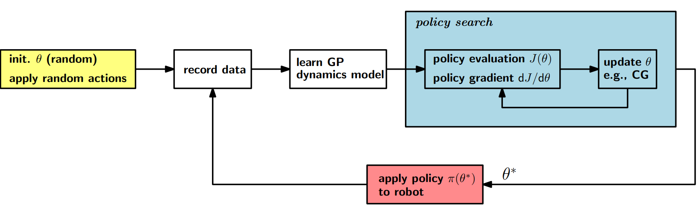

# PILCO — Probabilistic Inference for Learning COntrol


[Image source](https://pdfs.semanticscholar.org/c3ae/a964f75b04e2ee04082cbf94d034f3af1b4b.pdf)

This is our implementation of [PILCO](http://mlg.eng.cam.ac.uk/pilco/) from Deisenroth, et al.  
The implementation is largely based on the [matlab code](https://github.com/ICL-SML/pilco-matlab) and the [PhD thesis](https://www.google.de/url?sa=t&rct=j&q=&esrc=s&source=web&cd=1&cad=rja&uact=8&ved=2ahUKEwiR4sHA6ejgAhVSzaQKHaPRAt4QFjAAegQIChAB&url=https%3A%2F%2Fwww.ksp.kit.edu%2Fdownload%2F1000019799&usg=AOvVaw1zhWQ8A31UbT_oR7E2kP07) of Deisenroth. 
Other cool implementations can be found [here](https://github.com/nrontsis/PILCO) and [here](https://github.com/cryscan/pilco-learner).  

## Code structure
- [controller](./controller): Controller/policy models.
- [cost_functions](./cost_function): Cost functions for computing a trajectory's performance.
- [gaussian_process](./gaussian_process): (Sparse) Gaussian Process models for learning dynamics and RBF policy. 
- [kernel](./kernel): Kernel functions for Gaussian Process models.
- [test](./test): Test cases to ensure the implementation is working as intended.   
- [util](./util): Helper methods to make main code more readable.


## Executing experiments
1) Activate the anaconda environment
```bash
source activate my_env
```
2) Execute the [pilco_runner](../pilco_runner.py) script (the default environment is CartpoleStabShort-v0)

Training run from scratch:
```bash
python3 my/path/to/pilco_runner.py
```

Training run from an existing policy:
```bash
python3 my/path/to/pilco_runner.py --weight-dir my_model_directory
```

More console arguments (e.g. hyperparameter changes) can be added to the run, for details see
```bash
python3 my/path/to/pilco_runner.py --help
```

## Executing evaluation run for existing policy
1) Activate the anaconda environment
```bash
source activate my_env
```

2) Execute the [pilco_runner](../pilco_runner.py) script
```bash
python3 my/path/to/pilco_runner.py --weight-dir my_model_directory --test
```
